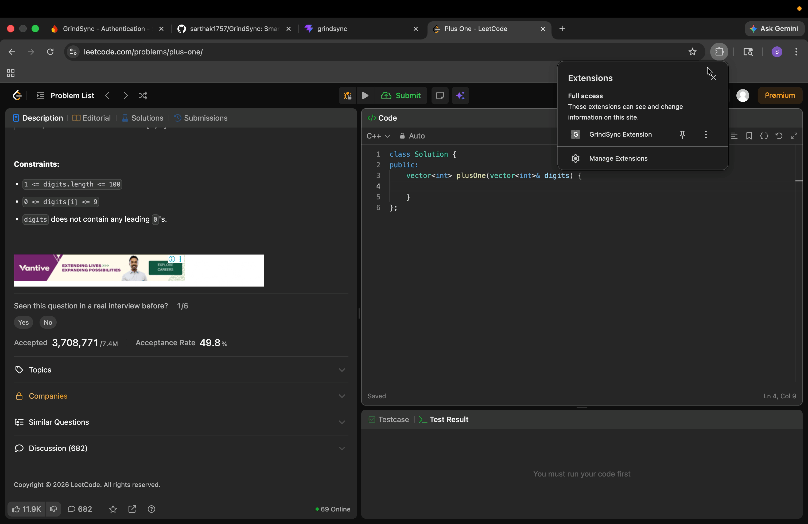
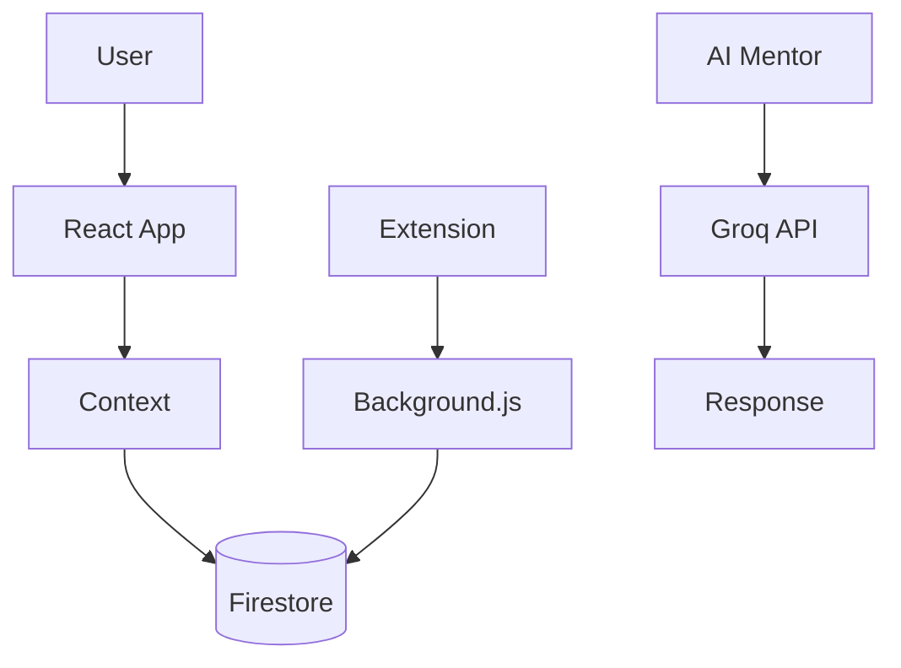

# GrindSync

GrindSync is a comprehensive DSA (Data Structures and Algorithms) tracking web application designed to help software engineers systematically improve their coding skills on platforms like LeetCode and Codeforces.

## 💡 Why GrindSync Exists

Every placement season, thousands of students grind LeetCode in isolation. They solve 300+ problems but forget half of them by interview time because they never revisited the hard ones when memory was fading.

GrindSync fixes this by bringing neuroscience-backed spaced repetition to coding practice. It's not just a tracker—it's a personal coach that knows when you're about to forget something and surfaces it at the perfect moment.

The Chrome extension removes friction. The AI mentor removes isolation. The group challenges remove the loneliness of solo prep. Together, they turn grinding into growth.

## 🎬 Demo Workflow



## Demo Account (For Evaluation)

**Email:** `demo@grindsync.com`  
**Password:** `Demo@123`

## Setup (Exact Steps)

1. Clone repo
2. `cd grindsync && npm install`
3. Create `.env` with:
   ```env
   VITE_FIREBASE_API_KEY=...
   VITE_GROQ_API_KEY=...
   ```
4. `npm run dev`
5. Open `http://localhost:5174`

               OR
Open "https://grind-sync-seven.vercel.app" login using demo@grindsync.com and Demo@123

## Core Features Implemented

### 1. Spaced Repetition System ✅
- Questions resurface based on performance
- Time-based mastery scoring
- 1.5x time override for accuracy

### 2. AI Mentor ✅  
- Google Gemini integration
- Weakness analysis
- Conversational guidance

### 3. Chrome Extension ✅
- Auto-tracks LeetCode/Codeforces
- Background service worker
- Real-time sync to Firestore

### 4. Group Challenges ✅
- Create groups with invite codes
- Live leaderboards
- 1v1 challenges with auto-winner

### 5. Analytics Dashboard ✅
- Contribution heatmap (365 days)
- Topic mastery breakdown
- Solve history graphs

## React Concepts Used

- ✅ Context API (Auth, Questions, Groups)
- ✅ Custom Hooks (useRevisionScheduler, useAIMentor)
- ✅ useMemo/useCallback for optimization
- ✅ React.lazy + Suspense for code splitting
- ✅ Real-time Firestore listeners
- ✅ Protected Routes
- ✅ Controlled components throughout

## Architecture Diagram


